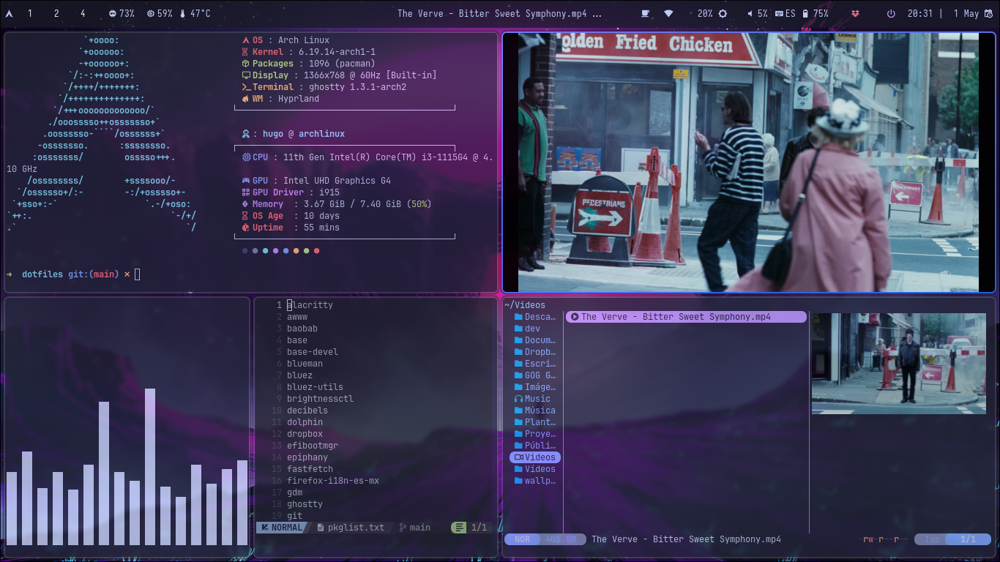

<div align="center">

# 🌸 HprHufloig's Dotfiles


*Una configuración altamente personalizada y funcional para Arch Linux con Hyprland*

</div>

---

## 📸 Screenshot



---

## ⚡ Stack

| Componente | Herramienta |
|-----------|-------------|
| 🖥️ OS | Arch Linux |
| 🪟 Window Manager | Hyprland |
| 📊 Bar | Waybar |
| 🎨 Theme | Tokyo Night |
| 🖥️ Terminal | Ghostty |
| 🐚 Shell | Zsh |
| 📁 File Manager | Yazi |
| 🚀 Launcher | Wofi |
| 🔔 Notifications | Swaync |
| 🔒 Lock Screen | Hyprlock |
| 🖼️ Wallpaper | Swww + Waypaper |
| ✏️ Editor | Neovim |
| 📈 System Monitor | Btop |
| 🔍 Fetch | Fastfetch |

---

## ✨ Características

- 🎨 **Tema Tokyo Night** — consistente en toda la configuración
- 📦 **Waybar personalizado** — con módulos custom para Dropbox, red y batería
- 🖼️ **Wallpapers animados** — soporte para GIFs con transiciones suaves
- 🔒 **Pantalla de bloqueo** — con blur del wallpaper actual y reloj
- 📂 **Dotfiles organizados** — con symlinks para fácil mantenimiento
- ⌨️ **Atajos de teclado** — flujo de trabajo optimizado
- 🔔 **Notificaciones de batería** — alertas automáticas al 30%, 15% y 5%
- 🌐 **NetworkManager dmenu** — gestión de redes desde el teclado

---

## 🚀 Instalación

> ⚠️ **Requisitos:** Arch Linux con Hyprland instalado y funcionando.

### 1. Instalar dependencias base

```bash
sudo pacman -S git zsh base-devel
```

### 2. Clonar el repositorio

```bash
mkdir -p ~/dev/config
git clone https://github.com/hufloig-wq/dotfiles.git ~/dev/config/dotfiles
cd ~/dev/config/dotfiles
```

### 3. Ejecutar el script de instalación

```bash
bash install.sh
```

El script mostrará un menú con las siguientes opciones:

| Opción | Descripción |
|--------|-------------|
| `1` | Instalación completa — paquetes + symlinks + fuentes |
| `2` | Solo symlinks — si ya tienes los paquetes instalados |
| `3` | Solo paquetes — sin tocar las configuraciones |
| `4` | Solo fuentes — instala las Nerd Fonts necesarias |

> 💡 **En una instalación nueva** selecciona la opción `1` para instalar todo automáticamente.

### 4. Post-instalación

```bash
# Recargar la configuración de Zsh
source ~/.zshrc

# Reiniciar la sesión de Hyprland
hyprctl dispatch exit

# Seleccionar wallpaper inicial
waypaper
```

### 5. Configurar Dropbox (opcional)

```bash
# Iniciar Dropbox manualmente cuando lo necesites
# desde el icono en Waybar (click para iniciar)
```

---

### ⚠️ Notas importantes

- Los archivos existentes se respaldan automáticamente en `~/.dotfiles_backup/`
- Los wallpapers deben colocarse en `~/wallpapers/`
- Para el módulo de temperatura en Waybar verifica la ruta correcta de tu hardware en `modules.json`

---

## 📁 Estructura

```
dotfiles/
├── hypr/                  # Hyprland, Hyprlock, Hyprpaper
├── waybar/                # Config, módulos, estilos y scripts
│   ├── config             # Configuración principal
│   ├── modules.json       # Módulos personalizados
│   ├── style.css          # Estilos Tokyo Night
│   ├── dropbox-status.sh  # Monitor de Dropbox
│   ├── battery-notify.sh  # Notificaciones de batería
│   └── power-menu.sh      # Menú de apagado
├── ghostty/               # Configuración del terminal
├── zsh/                   # .zshrc y aliases
├── wofi/                  # Lanzador de aplicaciones
├── yazi/                  # File manager
├── fastfetch/             # Sistema fetch
├── btop/                  # Monitor del sistema
├── nvim/                  # Neovim
├── waypaper/              # Gestión de wallpapers
├── networkmanager-dmenu/  # Gestión de redes
├── yt-dlp/                # Configuración de yt-dlp
├── pkglist.txt            # Paquetes oficiales
├── aur-pkglist.txt        # Paquetes AUR
└── install.sh             # Script de instalación
```

---

## ⌨️ Atajos principales

| Atajo | Acción |
|-------|--------|
| `Super + Enter` | Abrir terminal |
| `Super + W` | Wallpaper aleatorio |
| `Super + Q` | Cerrar ventana |
| `Super + L` | Bloquear pantalla |
| `Super + D` | Lanzador de apps |
| `Super + J` | Toggle split |

---

<div align="center">

*Hecho con ❤️ por HprHufloig*

</div>
